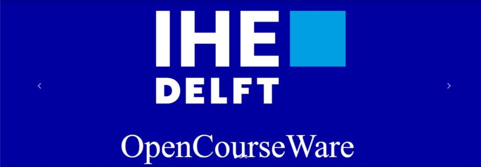

# WaPORMOOC

This repository contains Jupyter notebooks that are part of two MOOCs on the [WaPOR database](https://data.apps.fao.org/wapor/?lang=en). Both MOOCs are free to attend and are open to all who are interested. A reliable internet connection is required. These courses are self-paced with the possibility of obtaining a certificate of completion after completing all assignments.

1. Downloading WaPOR data (part of MOOC ['Introduction to WaPORv3'](https://ocw.un-ihe.org/course/view.php?id=263)) (also available in [Spanish](https://ocw.un-ihe.org/course/view.php?id=269))
2. Introduction to Python (module 2 of MOOC ['Python for geospatial analyses using WaPOR data'](https://ocw.un-ihe.org/course/view.php?id=272))
3. Using Python Libraries for Handling Spatial Data (module 3 of MOOC ['Python for geospatial analyses using WaPOR data'](https://ocw.un-ihe.org/course/view.php?id=272))

For the first script we are utilising the [WaPORDL](https://bitbucket.org/cioapps/wapordl/src/main/) package made available by FAO.
For more information on WaPOR can be found [here](https://www.fao.org/in-action/remote-sensing-for-water-productivity/en/)

This material is brought to you by the Water Accounting Team at IHE Delft Institute for Water Education

© 2024 IHE Delft Licenced under CC BY SA Creative Commons

** **
**For more on WaPOR applications check out these other courses:**

[Water Accounting and Water Productivity using WaPOR](https://ocw.un-ihe.org/course/view.php?id=92) (module 2 and 3) provides additional materials on how to implement water accounting and water productivity analyses using the WaPOR data (also available in [French](https://ocw.un-ihe.org/course/view.php?id=117) and [Arabic](https://ocw.un-ihe.org/course/view.php?id=118))

[WaPOR Concepts and Validation](https://ocw.un-ihe.org/course/view.php?id=214) provides more information regarding the concepts used to create the WaPOR data, as well as provide examples on how to validate the WaPOR data.

[Water Productivity in Practice](https://ocw.un-ihe.org/course/view.php?id=153) provides more information about the concept of water productivity and ways to improve it

[Water Accounting and Auditing](https://ocw.un-ihe.org/course/view.php?id=194) provides more information about the concepts of water accounting and auditing and tools how to generate water accounts (also available in [French](https://ocw.un-ihe.org/course/view.php?id=195))

More courses are available on the [OpenCourseWare platform](https://ocw.un-ihe.org) of [IHE Delft Institute for Water Education](https://un-ihe.org)

